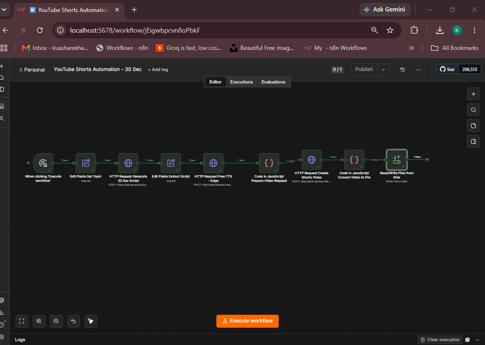

# 10. YouTube Shorts Automation (30 Sec)

**Tools:** n8n · Groq API (`openai/gpt-oss-20b`) · Edge TTS · local video service · Unsplash image

## Overview
Turns a single topic into a finished 30-second YouTube Short. The workflow writes a short Banglish script with AI, converts it to voice, combines the voice with a background image and title into an MP4, and saves the video to disk.

Example topic used: **"5 Amazing Facts About Artificial Intelligence"**

## How it works
| # | Node | What it does |
|---|---|---|
| 1 | When clicking 'Execute workflow' | Manual trigger |
| 2 | Edit Fields – Set Topic | Sets the video topic |
| 3 | HTTP Request – Generate 30 Sec Script | Sends the topic to the Groq chat completions API and asks for a 60–75 word Banglish script that starts with a strong hook |
| 4 | Edit Fields – Extract Script | Takes the script text from the API response |
| 5 | HTTP Request – Free TTS (Edge) | Sends the script to a local TTS service (`/tts`, voice `en-US-AriaNeural`) and gets the audio back |
| 6 | Code – Prepare Video Request | Checks that audio was returned and adds the title and background image URL |
| 7 | HTTP Request – Create Shorts Video | Sends audio, title and image to a local video service (`/video`) |
| 8 | Code – Convert Video to File | Converts the base64 video from the response into an MP4 binary file |
| 9 | Read/Write Files from Disk | Saves the video as `youtube-short.mp4` |

## Files
| File | Description |
|---|---|
| `workflow.json` | n8n workflow export — import via **Workflows → Import from File** |
| `screenshot.png` | Workflow canvas |
| `youtube-short.mp4` | Sample output video produced by the workflow |

## Requirements
- n8n running in Docker (the workflow reaches the helper service at `host.docker.internal:5000`)
- A local helper service on port 5000 with two endpoints:
  - `POST /tts` — text to speech (Edge TTS)
  - `POST /video` — builds the MP4 from audio, title and image
  *(The helper service code is not included in this folder.)*
- A Groq API key

## Setup
1. Import `workflow.json` into n8n.
2. In the **Generate 30 Sec Script** node, replace `YOUR_GROQ_API_KEY` with your own key — better, store it as an n8n credential (Header Auth) instead of typing it into the node.
3. Start the local TTS/video service on port 5000.
4. Change the topic in **Set Topic**, then click **Execute workflow**.
5. The video is written to `/home/node/.n8n-files/youtube-short.mp4` inside the n8n container.
